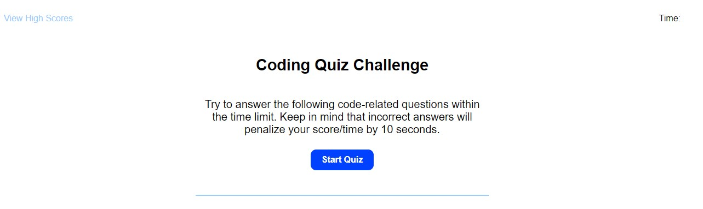
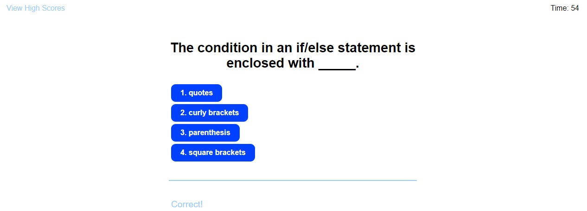
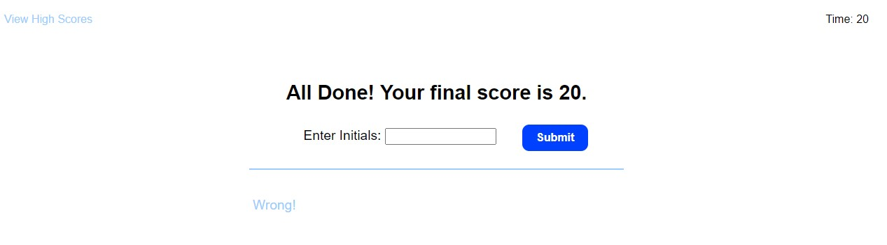
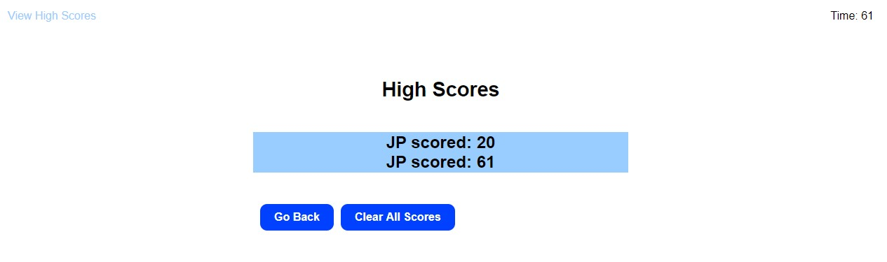

# Code-Quiz Challenge #4

## Challenge Description:
* Created a basic JavaScript code quiz with a timer that begins at the start of the quiz
* Questions iterate as answer buttons are selected
* "Wrong/Correct" response is given after each selection
* Initials and high scores are saved at the end of the quiz to local storage with the option of deleting them
* High score page can be selected at the beginning of the quiz

## Screenshots:

## Links:
### Link to deployed application:
* https://jenlpac.github.io/code-quiz/
### Link to Github repository
* https://github.com/jenlpac/code-quiz